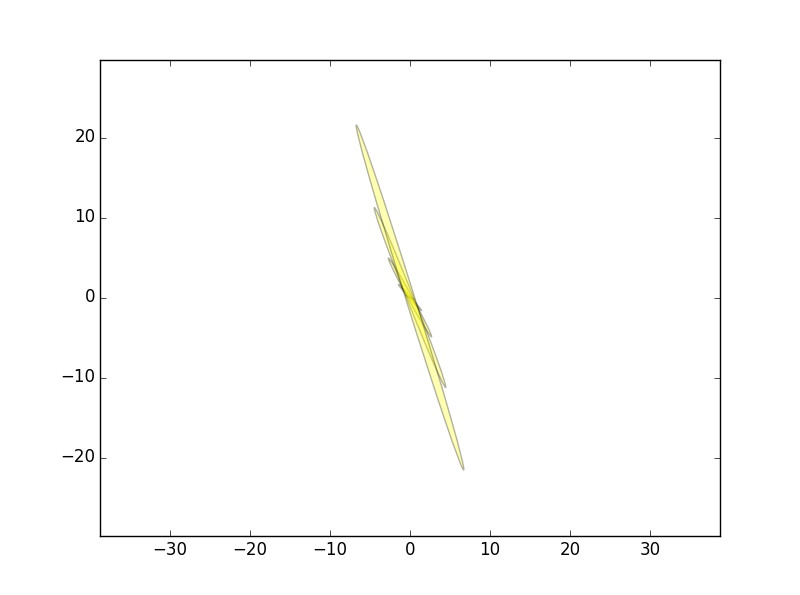
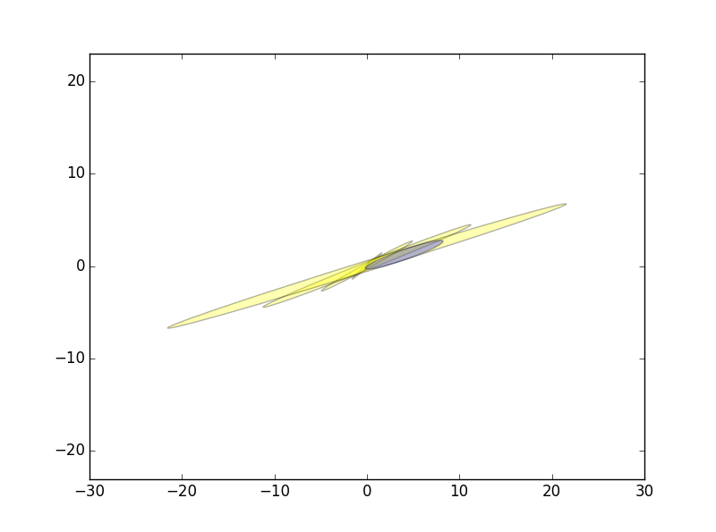

# 第三章 高斯滤波

## 1. 一维线性运动的汽车，位置、速度、加速度满足均值为零，协方差为1的高斯分布，时间间隔为1，假定可以设定每个时刻的加速度

### a) 最小的系统状态向量是什么

由于加速度可以设定，应当做控制变量，所以最小状态向量是位置和速度，如下
$$
X=\begin{bmatrix}x_t &\dot{x}_{t}\end{bmatrix}^T
$$

### b) 设计状态转移概率$p(x_t|u_t, x_{t-1})$

由于没有观测步骤，所以直接考虑预测步骤，根据位置、速度、加速度的关系，可以得到状态转移方程为
$$
x_t=Ax_{t-1}+Bu_t+{\epsilon}_t
$$
其中
$$
A=\begin{bmatrix}1 &\Delta{t} \\0 &1\end{bmatrix} = \begin{bmatrix}1 &1 \\0 &1\end{bmatrix} \\
B=\begin{bmatrix}\frac{(\Delta{t})^2}{2} \\ \Delta{t}\end{bmatrix}=\begin{bmatrix}\frac{1}{2} \\ 1\end{bmatrix}
$$

而 $$\epsilon_t$$ 由加速度产生，所以协方差矩阵$$R$$满足
$$
R=\sigma^2BB^T=\begin{bmatrix}\frac{1}{4} &\frac{1}{2} \\ \frac{1}{2} &1 \end{bmatrix}
$$

### c) 假设$t=0, x_0=0, \dot{x}_0=0$，求$t=1,2,3,4,5$的状态分布

由于没有观测步骤，所以
$$
\mu_t=\bar{\mu}_t \\
\Sigma_t=\bar{\Sigma}_t
$$
根据
$$
\bar{\mu}_t=A_t\mu_{t-1}+B_tu_t \\
\bar{\Sigma}_t=A_t\Sigma_{t-1}A_t^T+R_t
$$
计算结果如下表所示

| $$t$$ | $$\mu_t$$                               | $$\Sigma_t$$                                               |
| ----- | --------------------------------------- | ---------------------------------------------------------- |
| 0     | $$\begin{bmatrix} 0 &0\end{bmatrix}^T$$ | $$\begin{bmatrix} 0 &0 \\ 0 &0 \end{bmatrix}$$             |
| 1     | $$\begin{bmatrix} 0 &0\end{bmatrix}^T$$ | $$\begin{bmatrix} 0.25 &0.5 \\ 0.5 &1 \end{bmatrix}$$      |
| 2     | $$\begin{bmatrix} 0 &0\end{bmatrix}^T$$ | $$\begin{bmatrix} 2.5 &2.0 \\ 2.0 &2.0 \end{bmatrix}$$     |
| 3     | $$\begin{bmatrix} 0 &0\end{bmatrix}^T$$ | $$\begin{bmatrix} 8.75 &4.5 \\ 4.5 &3.0 \end{bmatrix}$$    |
| 4     | $$\begin{bmatrix} 0 &0\end{bmatrix}^T$$ | $$\begin{bmatrix} 21.0 &8.0 \\ 8.0 &4.0 \end{bmatrix}$$    |
| 5     | $$\begin{bmatrix} 0 &0\end{bmatrix}^T$$ | $$\begin{bmatrix} 41.25 &12.5 \\ 12.5 &5.0 \end{bmatrix}$$ |

### d) 将协方差矩阵绘制为不确定椭圆

绘制各时刻不确定椭圆如下

### e) 随着$t\to \infty$，位置和速度之间的关系会如何变化

根据变化趋势，不确定椭圆会越来越大，最终位置不确定性占主导

## 2. 加入观测步骤，假设时刻$t$测量位置为$z$，噪声方差为$\sigma^2=10$

### a) 求观测矩阵和观测方差

观测方程为
$$
z_t=Cx_t+\delta_t
$$
其中
$$
C=\begin{bmatrix} 1 &0 \end{bmatrix}\\
Q_t=\sigma_z^2CC^T=10
$$

### b) 实现测量更新，假设$t=5$时，观测$z=5$，计算更新前后卡尔曼滤波的参数

根据第一题可以知道
$$
\bar{\mu}_5=\begin{bmatrix} 0 &0 \end{bmatrix}^T \\
\bar{\Sigma}_5=\begin{bmatrix} 41.25 &12.5 \\ 12.5 &5.0 \end{bmatrix}
$$
根据程序3.1，可以计算卡尔曼增益以及观测更新
$$
K_5=\bar{\Sigma}_5C_5^T(C_5\bar{\Sigma}_5C_5^T+Q_t)^{-1}=\begin{bmatrix} 0.8049 \\0.2439\end{bmatrix} \\
\mu_5=\bar{\mu}_5+K_5(z_5-C_5\bar{\mu}_5)=\begin{bmatrix} 4.0244 \\1.220\end{bmatrix} \\
{\Sigma}_5=(I-K_5C_5)\bar{\Sigma}_5=\begin{bmatrix} 8.0488 &2.4390 \\2.4390 &1.9512\end{bmatrix}
$$
观测更新后的不确定椭圆如蓝色区域所示，说明经过观测后，系统的不确定性得到了降低。

## 3. 使用傅里叶变换或者z变换的卷积定理证明卡尔曼滤波的预测步

这道题的本质是使用卷积公式证明高斯分布的可叠加性，首先介绍卷积公式，对于独立随机变量$$X$$和$$Y$$，变量$$Z=X+Y$$的分布满足以下关系
$$
p_Z(Z)=\int_{-\infty}^{\infty}{p_X(Z-Y)p_Y(Y)dY}=p_X(Z)*p_Y(Z)
$$

傅里叶变换卷积定理为
$$
F[f(t)*g(t)]=F[f(\omega)]\cdot F[g(\omega)]
$$
对于正态分布$$X \sim N(\mu_X, \Sigma_X)$$，$$Y \sim N(\mu_Y, \Sigma_Y)$$，傅里叶变换为
$$
\begin{align}
F[p_X(X)]&=\eta e^{-\frac{1}{2}\omega^T\Sigma_X\omega -j\omega\mu_X} \\
F[p_Y(Y)]&=\eta e^{-\frac{1}{2}\omega^T\Sigma_Y\omega -j\omega\mu_Y} \\
\end{align}
$$
对$$p_Z(Z=X+Y)$$求傅里叶变换可得
$$
\begin{align}
\begin{array}
/ F[p_Z(Z)]&=F[p_X(Z)*p_Y(Z)]=F[p_X(Z)]\cdot F[p_Y(Z)] \\
&=\eta e^{-\frac{1}{2}\omega^T(\Sigma_X+\Sigma_Y)\omega-j\omega(\mu_X+\mu_Y)}
\end{array}
\end{align}
$$

对式(15)做傅里叶逆变换，以及高斯函数的性质，可以推导出以下三式，这三个公式描述了高斯分布的可加性

$$
\begin{align}
X+Y &\sim N(\mu_X+\mu_Y, \Sigma_X + \Sigma_Y) \\
AX &\sim N(A\mu_X, A\Sigma_X A^T) \\
X+B &\sim N(\mu_X+B, \Sigma_X)
\end{align}
$$

对于卡尔曼滤波的预测步
$$
x_t=A_tx_{t-1}+Bu_t+\epsilon_t
$$
其中$$x_{t-1}$$和$$\epsilon_t$$为相互独立的正态分布，所以满足高斯分布的可叠加性，因此后验概率满足
$$
X_t \sim N(A\mu_{t-1}+Bu_t, A\Sigma_{t-1}A^T+R_t)
$$

## 4. 